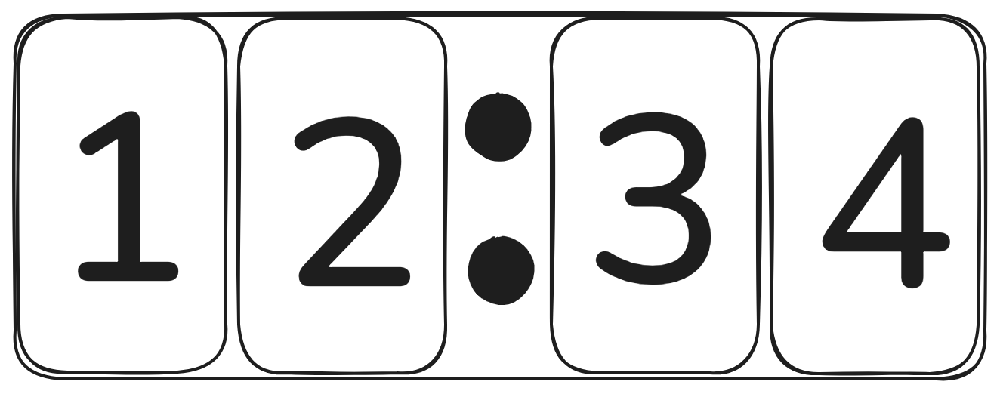

# July 20th: Initial ideation and design

This idea popped into my head today to try and make one of those cool split flaps I've seen a bunch before. It should be e good step up from my hackpad and will be a really fun project.

I eventually decided to try and settle on a design of 4 split flap modules, and put them in an array so that they would make a clock:

I then worked on getting some parts decided and I settled on 28BYJ48 Steppers with ULN2003 drivers as they're common, cheap, and well supported

I'm also going to use an Arduino Nano ESP32 as the mainboard and just started work on the PCB

For a hall effect sensor, I'm thinking of the A3144 digital sensor with some 4x1mm magnets

In terms of power, 4 steppers peak at around 250mA each so I'm specing for 1 A total current draw + the tiny amount the ESP uses. I was originally thinking of using a barrel connector with a 5V 2A power supply or something but barrel connectors _suck_ so much so I'm now thinking of maybe USB C _BUT_ I can't run that through the ESP or else it would be bad so then I'd need 2 USB ports which hurts my soul. So probably barrel connector. 

Also. I hate CAD. I'm scared for that part. (And so is my 2015 macbook)

**Total time spent: 2h ish**

# July 21st: Schematics are hard

I started work on the ✨ _schematic_ ✨ today and I have a more general idea of what I'm doing but I also have a LOT more questions. I learned how to make my own footprints and schematics in KiCad because most of the components I'm using don't have any I could find. (Shoutout to https://eleif.net/photomeasure so that I could take measurements on like the only reference image of my stepper driver on the internet) I ended up completely nuking my schematic a few times before I settled on it and I just realized that I have no idea how JST connectors actually work but that's a tomorrow problem. After I figure out what a JST is (or why a JST is?) I just need to develop the main board which _shouldn't_ 🤞 be too different or complicated (_it probably will be_)

ALSO BEFORE I FORGET TO PUT IT HERE HUGE SHOUTOUT TO MorganManley's [AWESOME SPLIT FLAP GUIDE](https://www.instructables.com/Split-Flap-Display-3D-Printed-Modular-Compact-Encl/) THAT I'M ONLY SLIGHTLY COPYING OFF OF (but like seriously its such good inspiration and your schematics are really helpful tysm)

Current schematic:

**Total time spent: 3h**
